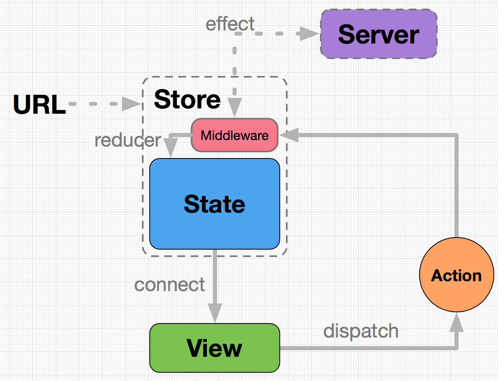

# Dva入门课

## React 没有解决的问题

### 通信问题

***组件之间如何通信？***

组件会发生三种通信。

- 向子组件发消息
- 向父组件发消息
- 向其他组件发消息

React 只提供了一种通信手段：**传参**（props）。对于大应用，很不方便。

### 数据流问题

***数据如何和视图串联起来？***

***路由和数据如何绑定？***

***如何编写异步逻辑？等等***

目前流行的数据流方案有：

- Flux，单向数据流方案，以 `Redux` 为代表
- Reactive，响应式数据流方案，以 `Mobx` 为代表
- 其他，比如 `rxjs` 等

到底哪一种架构最合适 React ？

截止 2017.1，最流行的社区 React 应用架构方案如下。

- 路由： `React-Router`
- 架构： `Redux`
- 异步操作： `Redux-saga`

缺点：要引入多个库，项目结构复杂。

dva 是阿里体验技术部开发的 React 应用框架，将上面三个 React 工具库包装在一起，让开发 React 应用更加方便和快捷。

`dva` = `React-Router` + `Redux` + `Redux-saga`

## 核心概念

- `State`：一个对象，保存整个应用状态
- `View`：React 组件构成的视图层
- `Action`：一个对象，描述事件
- `connect` 方法：一个函数，绑定 `State` 到 `View`
- `dispatch` 方法：一个函数，发送 `Action` 到 `State`


### State 

`State` 是储存数据的地方，收到 `Action` 以后，会更新数据。

### View

`View` 就是 React 组件构成的 UI 层，从 `State` 取数据后，渲染成 HTML 代码。只要 `State` 有变化，`View` 就会自动更新。

### Action

`Action` 是用来描述 UI 层事件的一个对象。

```
{
  type: 'click-submit-button',
  payload: this.form.data
}
```

### connect 方法

`connect` 是一个函数，绑定 `State` 到 `View`。

```
import { connect } from 'dva';

function mapStateToProps(state) {
  return { todos: state.todos };
}
connect(mapStateToProps)(App);
```

`connect` 方法返回的也是一个 React 组件，通常称为容器组件。

`connect` 方法传入的第一个参数是 `mapStateToProps` 函数，`mapStateToProps` 函数会返回一个对象，用于建立 `State` 到 `Props` 的映射关系。

### dispatch 方法

`dispatch` 是一个函数方法，用来将 `Action` 发送给 `State`。

```
dispatch({
  type: 'click-submit-button',
  payload: this.form.data
})
```

被 `connect` 的 Component 会自动在 `props` 中拥有 `dispatch` 方法。

## dva 应用的最简结构（带 model)

`dva` 提供 `app.model` 这个对象，所有的应用逻辑都定义在它上面。

```
// 创建应用
const app = dva();

// 注册 Model
app.model({
  namespace: 'count',
  state: 0,
  reducers: {
    add(state) { return state + 1 },
  },
  effects: {
    *addAfter1Second(action, { call, put }) {
      yield call(delay, 1000);
      yield put({ type: 'add' });
    },
  },
});

// 注册视图
app.router(() => <ConnectedApp />);

// 启动应用
app.start('#root');
```



## Model 对象的属性

- `namespace`: 当前 `Model` 的名称。整个应用的 `State`，由多个小的 `Model` 的 `State` 以 `namespace` 为 `key` 合成。
- `state`: 该 `Model` 当前的状态。数据保存在这里，直接决定了视图层的输出。
- `reducers`: `Action` 处理器，处理同步动作，用来算出最新的 `State`。
- `effects`：`Action` 处理器，处理异步动作。

### Reducer

`Reducer` 是 `Action` 处理器，用来处理同步操作，可以看做是 `state` 的计算器。

它的作用是根据 `Action`，从上一个 `State` 算出当前 `State`。

### Effects

`Effects` 是 `Action` 处理器，用来处理异步动作，基于 `Redux-saga` 实现。

根据函数式编程，计算以外的操作都属于 `Effect`，典型的就是 I/O 操作、数据库读写。

- Generator 函数

`Effect` 是一个 `Generator` 函数，内部使用 `yield` 关键字标识每一步的操作（不管是异步或同步）。

- `call` 和 `put`

  `dva` 提供多个 `effect` 函数内部的处理函数，比较常用的是 `call` 和 `put`。

  - `call`：执行异步函数
  - `put`：发出一个 `Action`，类似于 `dispatch`